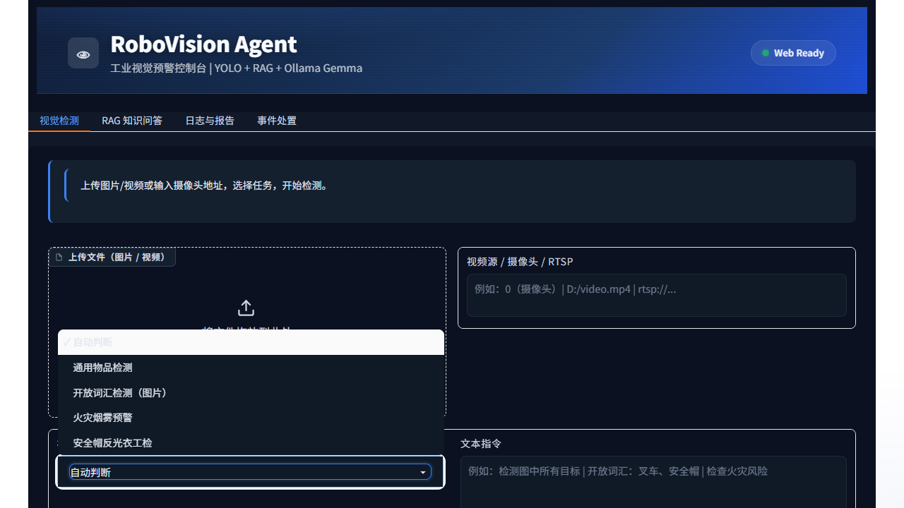

# RoboVision Agent

[](https://github.com/Raowang55/RoboVision-Agent/actions/workflows/ci.yml)

面向工业安全巡检的本地多工具 AI Agent。项目将真实 YOLO 视觉检测、RAG 安全知识检索、事件日志和规则化处置工单组织在一个 Gradio 控制台中；LLM 是可选增强，没有 API 或本地大模型时仍可完成核心演示。



## 解决的问题

普通检测脚本只能返回框和类别，无法继续回答“检测到这些目标后应遵循什么规范”，也缺少告警去重、事件留痕和处置结果。本项目用一个可观察的 Orchestrator 串联四类真实工具：

```text
用户输入 / 图片 / 视频
        |
        v
Agent Orchestrator
  |-- 显式任务或关键词规则路由（默认、离线）
  |-- 可选 LLM 结构化意图解析
  |-- 固定复合链：检测 -> 类别提取 -> RAG 安全建议
        |
        +-- YOLO / YOLO-World 检测
        +-- BGE + Chroma 本地知识检索
        +-- CSV 事件日志与巡检报告
        +-- SQLite 处置工单与可选企业微信通知
```

每次执行返回统一的 `AgentResponse`，包含结果、产物路径、错误、路由来源和工具耗时 trace；trace 不保存或展示模型思维链。

## 已实现能力

| 能力 | 实现与边界 |
| --- | --- |
| 图片/视频检测 | YOLO-World 通用检测；支持文件、摄像头编号和 RTSP 输入 |
| 开放词汇检测 | 将用户提供的类别交给 YOLO-World `set_classes()`，不使用随机框 |
| 开放词汇 UI | 选择“开放词汇检测（图片）”，在文本框输入逗号分隔类别（如 `forklift, helmet`）；该任务明确只接受图片 |
| Fire/PPE 专项 | Fire 默认使用第三方 YOLOv8n 火焰/烟雾权重（类别为 `fire` / `smoke`）并叠加连续帧与冷却规则；PPE 只将模型明确输出的 `No-Helmet` / `No-Vest` 计为违规 |
| RAG | BGE embedding + Chroma；首次查询自动建索引，知识文件变化后按 SHA-256 自动刷新，回答返回来源文件与 chunk id |
| Agent 路由 | 显式任务优先、关键词规则兜底；启用 LLM 后可解析模糊意图；检测后查规范使用确定性的两步链 |
| 事件处置 | 校验、分析、法规匹配、分级联动、派单、总结；SQLite 工单从 `dispatched` 更新为 `completed` |
| 工程验证 | 无网络快速 CI、可选真实模型测试、RAG Hit@K 评测、真实推理延迟 benchmark 和环境 doctor |

## 快速开始

项目按 Python 3.11 测试。

```bash
python -m venv .venv
# Windows: .venv\Scripts\activate
# Linux/macOS: source .venv/bin/activate
pip install -e ".[test]"

python scripts/download_models.py
python scripts/doctor.py
python run_server.py
```

### 可重复闭环演示

使用一张本地图片执行“视觉检测 → RAG 引用 → 规则化处置 → SQLite 工单完成”的完整链路。默认使用临时数据库且不发送企业微信：

```bash
python scripts/demo_smoke.py --image path/to/image.jpg --task general --output output/demo_smoke_report.json
```

需要云端生成式回答时增加 `--use-llm`。只有明确希望发送真实通知时才增加 `--send-notification`。报告包含 Planner 来源、工具序列、每步耗时、检测类别、RAG 来源、工单状态和验收项。

浏览器打开终端显示的地址，默认从 `127.0.0.1:7861` 开始寻找可用端口。模型文件不提交到 Git，文件名和能力边界见 [`weights/README.md`](weights/README.md)。

`download_models.py` 仅下载有公开来源和 SHA-256 的 YOLO-World 与火焰/烟雾权重；PPE 权重没有可核验的上游来源，保留为用户自行提供的可选项。

### 可选 LLM

复制 `.env.example` 为 `.env`。默认 `LLM_ENABLED=false`，规则路由和检索问答不依赖 LLM。Ollama 可使用 OpenAI-compatible 地址：

```dotenv
LLM_ENABLED=true
LLM_BASE_URL=http://localhost:11434/v1
LLM_MODEL=gemma4:31b
LLM_API_KEY=
```

DeepSeek 等兼容服务只需替换 `LLM_BASE_URL`、`LLM_MODEL` 和 `LLM_API_KEY`。客户端只发起一次有界请求，失败后返回规则/检索结果，不进行分钟级重试。

## 测试与评测

```bash
# CI 使用：不访问网络、不要求模型权重或 LLM
python -m ruff check app tests scripts run_server.py
python -m pytest tests -m "not model and not llm and not ui" -q

# 本地 UI 组件回归（Gradio 首次启动较慢，因此不放入快速 CI）
python -m pytest tests -m ui -q

# 本地可选：真实权重推理
python -m pytest tests/test_integration.py -m model -q

# 12 条知识库问题的来源 Hit@3，当前本地实测为 1.0
python scripts/evaluate_rag.py --top-k 3

# 20 条中英文指令的意图路由、工具序列和路由耗时评测
python scripts/evaluate_agent.py

# 对指定图片执行真实推理并输出 mean/P50/P95/FPS
python scripts/benchmark.py --model weights/yolov8s-worldv2.pt --source path/to/image.jpg --device cpu
```

RAG 评测只判断预期来源是否进入 Top-K，不用 LLM 主观打分。Benchmark 数字取决于硬件、模型和输入，不在文档中声明通用性能。

## 主要结构

```text
app/
  agent.py                 # 单一工具注册表、规则/LLM 路由、固定复合链
  contracts.py             # AgentResponse / ToolResult / AgentStep
  runtime/                 # YOLO 检测与连续帧告警规则
  rag/                     # 文档切分、自动索引、检索与可选生成
  agents/                  # 规则化处置工作流和 SQLite repository
  tools/                   # 开放词汇、日志、报告等真实工具
  ui/                      # Gradio 四个工作区
scripts/
  doctor.py                # 只读环境检查
  benchmark.py             # 真实模型性能测量
  evaluate_rag.py          # 离线来源 Hit@K
  evaluate_agent.py        # 20 条离线路由与工具序列评测
  demo_smoke.py            # 检测、RAG、临时工单闭环演示
tests/                     # 快速单元/集成测试与可选真实模型测试
```

## 已知限制

- 本项目集成现有模型权重，不把第三方权重训练描述为个人成果；权重来源和指标不明确时不声明精度。
- PPE 不通过“整帧缺少安全帽”推断个人违规，只使用专项模型明确输出的负类，因此避免了多人场景中的明显误判，但不等同于完整的人体-装备关联算法。
- HSV 火焰颜色候选默认关闭，且不会作为正式模型置信度；如实验性开启，应单独评估误报。
- 视频标注结果会转为浏览器兼容的 H.264 MP4；该步骤由 `imageio-ffmpeg` 提供的 FFmpeg 运行时完成。
- 处置模块是确定性业务工作流，不是 LangGraph，也不是多个自主智能体。
- 项目没有实现 SAM、模型训练、ONNX/TensorRT 导出、分布式任务队列或生产级权限系统。

## License

代码以 [MIT License](LICENSE) 发布。第三方模型权重、数据集和依赖分别遵循其上游许可证；它们不随本仓库提交。
